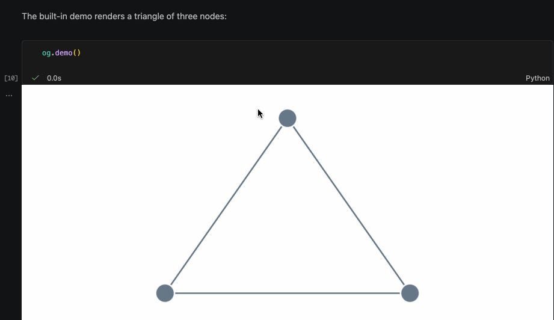

# ogma-jupyter

Interactive [Ogma](https://doc.linkurio.us/ogma/latest/) graph visualization for Jupyter notebooks.
Built with [anywidget](https://anywidget.dev/).



<sub>Illustrative preview. See [`examples/`](examples/) for runnable notebooks.</sub>

> **Status:** MVP complete — Python API, JavaScript widget, and test suite are all in place.

## Installation

Requires **Python 3.9, 3.10, 3.11, or 3.12**.

```bash
pip install ogma-jupyter
```

Ogma is a commercial library from [Linkurious](https://linkurio.us). You need a
license key to use the visualization — contact
[Linkurious](https://linkurio.us/contact/) to obtain one. The license key both
unlocks the rendered graph and authenticates the one-time download of the Ogma
library (cached afterwards).

```bash
export OGMA_LICENSE_KEY=your-license-key
```

### Getting your license key

1. Log in to the Linkurious download platform at
   [get.linkurio.us](https://get.linkurio.us).
2. Open your Ogma license.
3. Copy the **npm install URL**. It looks like this:

   ```
   https://get.linkurio.us/api/get/npm/ogma/6.0.5/?secret=<YOUR_LICENSE_KEY>
   ```

4. Your license key is the value **after `?secret=`** — in the example above:

   ```
   lk-dls-*****
   ```

Use that `lk-dls-…` value as your `OGMA_LICENSE_KEY` (or pass it to
`og.set_license(...)`). Keep it private — it authenticates your Ogma download.

## Quick start

Launch a notebook front-end (any of JupyterLab, Jupyter Notebook, VS Code, or
Colab works):

```bash
pip install jupyterlab   # if you don't have a notebook front-end yet
jupyter lab              # opens in your browser
```

In the browser, create a new notebook via **File → New → Notebook**, then run
the cells below with **Shift+Enter**:

```python
import ogma_jupyter as og

# Set your license key once per session (or use the OGMA_LICENSE_KEY env var)
og.set_license("your-license-key")

# Display a demo graph
og.demo()
```

> The first render downloads the Ogma library once using your license key and
> caches it. The interactive graph only appears in a notebook front-end — a
> headless `jupyter nbconvert --execute` runs the code but won't display the
> widget.

```python
# Build a graph from your own data
widget = og.OgmaWidget(
    graph_data={
        "nodes": [
            {"id": "alice", "data": {"name": "Alice", "role": "engineer"}},
            {"id": "bob",   "data": {"name": "Bob",   "role": "manager"}},
        ],
        "edges": [
            {"source": "alice", "target": "bob", "data": {"label": "reports to"}},
        ],
    }
)
widget
```

### License key resolution order

1. `license_key=` argument on `OgmaWidget(...)`
2. `og.set_license("key")` called earlier in the notebook
3. `OGMA_LICENSE_KEY` environment variable

## Graph data format

`graph_data` follows Ogma's `RawGraph` schema:

```python
{
    "nodes": [
        {
            "id": "n1",                        # optional, auto-assigned if omitted
            "attributes": {"x": 0, "y": -60},  # visual attributes (position, color, …)
            "data": {"name": "Alice"},          # your domain data
        }
    ],
    "edges": [
        {
            "source": "n1",   # required
            "target": "n2",   # required
            "data": {"weight": 1.5},
        }
    ],
}
```

## Layouts

Run a layout algorithm to arrange nodes automatically:

```python
widget.run_layout("force")
widget.run_layout("hierarchical", direction="LR")
widget.run_layout("radial", duration=500)
```

Available layouts: `concentric`, `force`, `forcelink`, `grid`, `hierarchical`, `radial`, `sequential` (`forceatlas2` is accepted as an alias for `forcelink`).

## Style rules

Use `ogma_jupyter.rules` helpers to bind visual properties to data fields.

```python
from ogma_jupyter import rules

widget.add_style_rule(
    node_attributes={
        # categorical: map a field value to a color
        "color": rules.map(
            field="data.role",
            values={"engineer": "#4e79a7", "manager": "#f28e2b"},
            fallback="gray",
        ),
        # numerical: size nodes by a score (5 slices, radius 4–20)
        "radius": rules.slices(
            field="data.score",
            values={"nbSlices": 5, "min": 4, "max": 20},
        ),
        # template: build a label from data properties
        "text": {"content": rules.template("{{data.name}}")},
    }
)
```

### Rule helpers

| Helper | Description | Mirrors |
|---|---|---|
| `rules.map(field, values, fallback=)` | Categorical data → output value | `ogma.rules.map()` |
| `rules.slices(field, values, stops=, fallback=, reverse=)` | Numerical range → output value | `ogma.rules.slices()` |
| `rules.template(template_str)` | `{{field}}` string interpolation | `ogma.rules.template()` |

## Grouping

Collapse nodes that share a data property into a single meta-node:

```python
widget.group_nodes(key="data.department")

# Restore individual nodes
widget.ungroup_nodes()
```

## API reference

### `og.set_license(key, download=False)`

Set the Ogma license key for the current session. Pass `download=True` to
immediately fetch and cache the Ogma JS bundle using the key.

Otherwise the Ogma bundle is downloaded lazily on first widget render, using the
configured license key (`og.set_license(...)` or the `OGMA_LICENSE_KEY`
environment variable). The download happens once and is cached for later
sessions.

### `og.demo()`

Render a small sample graph (no data needed).

### `OgmaWidget(graph_data=None, license_key=None, **kwargs)`

The core widget. All parameters are optional at construction time — you can set `widget.graph_data` at any point and the visualization updates live.

| Attribute | Type | Description |
|---|---|---|
| `graph_data` | dict | `RawGraph` — nodes and edges |
| `style_rules` | list | Accumulated style rule dicts |
| `graph_layout` | dict | Last layout config, e.g. `{"name": "force"}` |

| Method | Description |
|---|---|
| `add_style_rule(node_attributes=, edge_attributes=)` | Append a style rule |
| `run_layout(name, **options)` | Run a layout algorithm |
| `group_nodes(key)` | Group nodes by a data property path |
| `ungroup_nodes()` | Remove all groupings |

## Supported environments

Python 3.9–3.12, in any of:

- JupyterLab
- VS Code notebooks
- Google Colab
- Classic Jupyter Notebook
- Databricks notebooks

## Development

### Setup

```bash
git clone https://github.com/Linkurious/ogma-jupyter.git
cd ogma-jupyter

python -m venv .venv
source .venv/bin/activate   # Windows: .venv\Scripts\activate

pip install -e ".[dev]"
```

### Run tests

```bash
pytest
```

### Build JavaScript (Linkurious devs only)

Access to the `@linkurious/ogma` npm package is required. The project already
declares it as a plain semver dependency — all you need is to set the
`OGMA_DOWNLOAD_KEY` environment variable so npm can authenticate against the
private registry (the `.npmrc` in the project root already points to it).

**Derive your `OGMA_DOWNLOAD_KEY`:**

1. Log in to [get.linkurio.us](https://get.linkurio.us) and copy the npm install
   link for Ogma. It looks like:
   ```
   https://get.linkurio.us/api/get/npm/ogma/<VERSION>/?secret=lk-dls-xxxx…
   ```
2. Take the value after `?secret=` and base64-encode it with the prefix `any:`:
   ```bash
   export OGMA_DOWNLOAD_KEY=$(printf '%s' 'any:lk-dls-xxxx…' | base64)
   ```

Then install and build:

```bash
npm install
npm run build   # builds the Ogma-free widget_core.js
npm run dev     # watch mode
```

> **Distribution note:** the build produces `widget_core.js`, which does **not**
> contain `@linkurious/ogma`. The commercial Ogma library is never committed or
> shipped in the package — it is downloaded at runtime (license-gated) via
> `og.set_license(key, download=True)` and assembled with the core into a cached
> bundle. The Ogma-embedded `widget.js` is git-ignored and excluded from the wheel.
>
> **Local development:** when working from a source checkout, the widget uses the
> `@linkurious/ogma` dev dependency in `node_modules` directly, so the examples and
> tests render offline without a license key or any network access.

## License

Apache License 2.0 — see [LICENSE](LICENSE).
